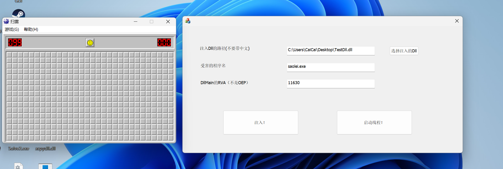
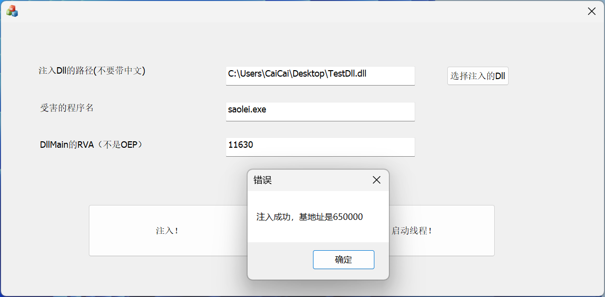
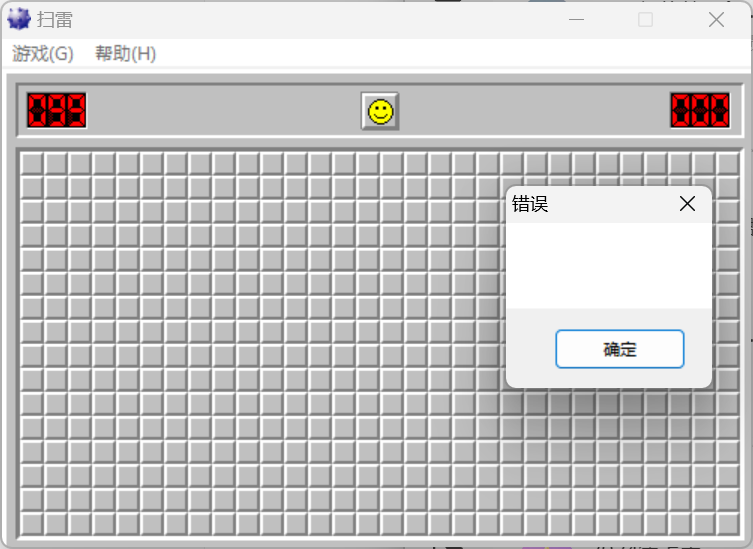
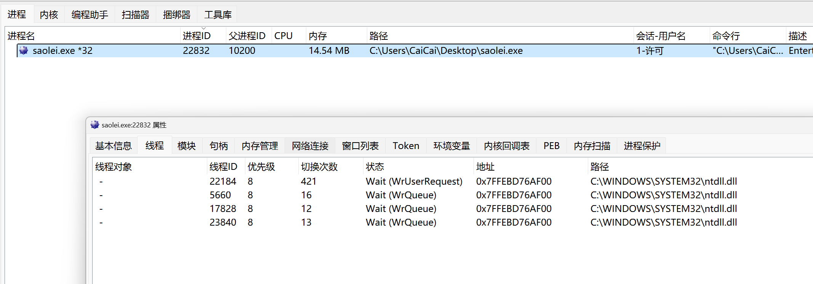
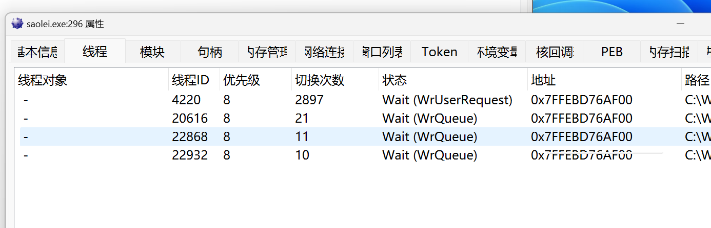
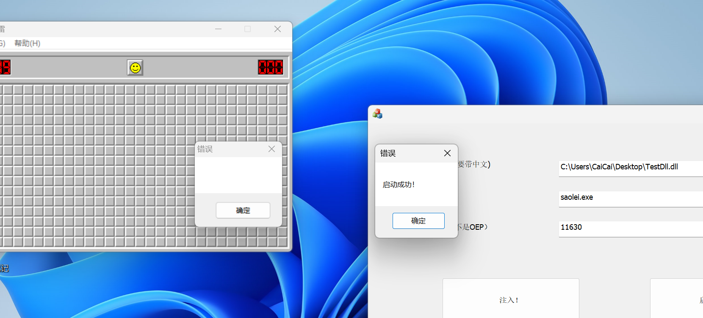
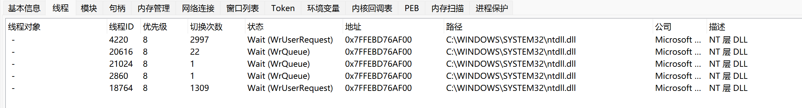

# 无模块注入Dll器项目(安全启动线程版)

## 项目介绍

无模块注入DLL器是一个用于将动态链接库（DLL）注入到目标进程的工具。与传统DLL注入器不同，它不通过加载整个DLL模块的方式来实现注入，而是采用内存映射等技术直接将DLL的代码映射到目标进程中执行。该项目的目标是实现一个高效、隐蔽的注入方式，以绕过某些防护机制和检测。 

而且与其他Dll注入器不同的是，注入后，是选择了劫持已知线程入口点起的线程，这样能够更有效地避免被检测


小小的局限：

分为32位和64位版本，32位版本只能注入32位dll，64位只能注射64位dll，太懒了哎，宏定义懒得写

另外路径名不支持中文，懒得改了呜呜


## 主要函数分析：

修复重定位表

```C++
// 修复重定位表
VOID RepairFixReloc( DWORD NewImageBase)
{

	DWORD Oep = pNtHeader->OptionalHeader.AddressOfEntryPoint;


	DWORD base = pNtHeader->OptionalHeader.ImageBase;
	// 1. 获取重定位表的 rva
	DWORD RelocRVA = pNtHeader->OptionalHeader.DataDirectory[5].VirtualAddress;
	// 2. 获取重定位表
	auto Reloc = (PIMAGE_BASE_RELOCATION)((SIZE_T)FileBase + (SIZE_T)RVAtoFOA(RelocRVA));

	// 3. 遍历重定位表中的重定位块，以0结尾
	while (Reloc->SizeOfBlock != 0)
	{


		// 3.1 输出分页基址
		//printf("[↓] 分页基址: 0x%08X \n\n", Reloc->VirtualAddress);
		// 3.2 找到重定位项
		auto Offset = (TypeOffset*)(Reloc + 1);

		// 3.3 计算重定位项的个数
		// Reloc->SizeOfBlock 保存的是整个重定位块的大小 结构体 + 重定位项数组
		// Reloc->SizeOfBlock - sizeof(IMAGE_BASE_RELOCATION) 得到单个数组大小
		// 上面的结果 \ 2 = 重定位项的个数，原因是重定位项的大小为两个字节
		DWORD Size = (Reloc->SizeOfBlock - sizeof(IMAGE_BASE_RELOCATION)) / 2;

		// 3.4 遍历所有的重定位项
		for (DWORD i = 0; i < Size; ++i)
		{


			DWORD Type = Offset[i].Type;                  // 获取重定位类型，只关心为3的类型
			DWORD pianyi = Offset[i].Offset;              // 获取重定位的偏移值
			DWORD rva = pianyi + Reloc->VirtualAddress;   // 获取要重定位的地址所在的RVA
			DWORD foa = RVAtoFOA(rva);                    // 获取要重定位的地址所在的FOA
			SIZE_T fa = foa + FileBase;                    // 获取要重定位的地址所在的fa
			DWORD addr = *(DWORD*)fa;                     // 获取要重定位的地址
			DWORD new_addr = addr - base + NewImageBase;     // 计算重定位后的数据: addr - oldbase + newbase

			// 将重定位后的数据写回缓冲区(文件)
			if (Offset[i].Type == 3)
				*(DWORD*)fa = new_addr;

			printf("\t [->] 重定位RVA: 0x%08X | 重定位FOA: 0x%08X | 重定位地址: 0x%08X | 修正地址: 0x%08X \n", rva, foa, addr, new_addr);
		}
		// 找到下一个重定位块
		Reloc = (PIMAGE_BASE_RELOCATION)((SIZE_T)Reloc + (SIZE_T)Reloc->SizeOfBlock);
	}
	// 保存修正后的文件
	pNtHeader->OptionalHeader.ImageBase = NewImageBase;
}

```


根据进程名获取PID

```C++
SIZE_T GetProcessIDByName(TCHAR* processName) {
	PROCESSENTRY32 processEntry;
	processEntry.dwSize = sizeof(PROCESSENTRY32);

	// 创建快照
	HANDLE hProcessSnapshot = CreateToolhelp32Snapshot(TH32CS_SNAPPROCESS, 0);
	if (hProcessSnapshot == INVALID_HANDLE_VALUE) {
		::MessageBox(0, TEXT("创建快照失败！"),0,0);
		return 0;
	}

	// 枚举进程
	if (Process32First(hProcessSnapshot, &processEntry)) {
		do {
			if (!_tcsicmp(processEntry.szExeFile, processName)) {
				CloseHandle(hProcessSnapshot);
				return processEntry.th32ProcessID;
			}
		} while (Process32Next(hProcessSnapshot, &processEntry));
	}

	CloseHandle(hProcessSnapshot);
	return 0;
}
```


拉伸PE结构

```C++

void Stretch_PE()
{
	SIZE_T Memory_Size = 0;
	Memory_Size = pNtHeader->OptionalHeader.SizeOfImage;
	Stretch_Data = (PVOID)malloc(sizeof(CHAR) * Memory_Size);
	memset(Stretch_Data, 0, Memory_Size);
	PVOID temp_before_stretch_data_ptr = (VOID*)FileBase;
	SIZE_T size_of_file = sizeof(IMAGE_FILE_HEADER);
	

	SIZE_T Size_Of_Optional = pNtHeader->FileHeader.SizeOfOptionalHeader;
	SIZE_T Size_Of_Section = sizeof(IMAGE_SECTION_HEADER);
	SIZE_T Size_Of_Header = pDosHeader->e_lfanew + size_of_file+Size_Of_Optional + Size_Of_Section * pNtHeader->FileHeader.NumberOfSections;//还未对齐
	memcpy_s(Stretch_Data, Memory_Size, (VOID*)FileBase, Size_Of_Header);
	PVOID temp_stretch_data = Stretch_Data;
	//现在计算head头对齐后的大小
	SIZE_T Size = Size_Of_Header % pNtHeader->OptionalHeader.SectionAlignment;
	Size_Of_Header = pNtHeader->OptionalHeader.SectionAlignment * Size;


	for (int i = 0; i < pNtHeader->FileHeader.NumberOfSections; i++)
	{
		temp_stretch_data = (PVOID)((PCHAR)Stretch_Data + Section[i]->VirtualAddress);
		temp_before_stretch_data_ptr = (PVOID)((SIZE_T)FileBase + (SIZE_T)Section[i]->PointerToRawData);
		memcpy_s(temp_stretch_data, Section[i]->SizeOfRawData, temp_before_stretch_data_ptr, Section[i]->SizeOfRawData);
	}
}
```


修复IAT表

```C++
VOID Repair_IAT(INJECTPARAM m_injectparam)
{

	//------------
		//修正IAT表
	ULONG_PTR ImportOffset = pNtHeader->OptionalHeader.DataDirectory[IMAGE_DIRECTORY_ENTRY_IMPORT].VirtualAddress;
	if (ImportOffset == 0)
	{
		return;
	}

	PIMAGE_IMPORT_DESCRIPTOR pImportDescriptor = reinterpret_cast<PIMAGE_IMPORT_DESCRIPTOR>(((ULONG_PTR)Stretch_Data + ImportOffset));

	PIMAGE_IMPORT_BY_NAME pImportByName = NULL;

	while (pImportDescriptor->Characteristics != 0)
	{
		HANDLE hDll = NULL;

		//获取Dll名称
		char* pDllName = reinterpret_cast<char*>((ULONG_PTR)Stretch_Data + pImportDescriptor->Name);
		//printf("%s\r\n", pDllName);

		HMODULE hNtDll = GetModuleHandle(TEXT("ntdll.dll"));


		ANSI_STRING AnsiStr;
		m_injectparam.Func_RtlInitAnsiString(&AnsiStr, pDllName);
		UNICODE_STRING UnicodeStr;

		m_injectparam.Func_RtlAnsiStringToUnicodeString(&UnicodeStr, (PCANSI_STRING)&AnsiStr, true);

		m_injectparam.Func_LdrLoadDll(NULL, NULL, &UnicodeStr, &hDll);  //加载这个DLL需要依赖的DLL

		m_injectparam.Func_RtlFreeUnicodeString(&UnicodeStr);

		if (hDll == NULL)
		{
			break;  //依赖的DLL没有加载成功
		}

		PIMAGE_THUNK_DATA pRealIAT = reinterpret_cast<PIMAGE_THUNK_DATA>((ULONG_PTR)Stretch_Data + pImportDescriptor->FirstThunk);
		PIMAGE_THUNK_DATA pOriginalIAT = reinterpret_cast<PIMAGE_THUNK_DATA>((ULONG_PTR)Stretch_Data + pImportDescriptor->OriginalFirstThunk);

		//printf("pRealIAT:%p  pOriginalIAT:%p\r\n", pRealIAT, pOriginalIAT);

		//获得此DLL中每一个导入函数的地址,用来填充导入表
		int i = 0;
		while (true)
		{
			if (pOriginalIAT[i].u1.Function == 0)
			{
				break;
			}

			//printf("Function:0x%X\r\n", pOriginalIAT[i].u1.Function);

			FARPROC lpFunction = NULL;

			if (IMAGE_SNAP_BY_ORDINAL(pOriginalIAT[i].u1.Ordinal)) //这里的值给出的是导出序列号
			{
				if (IMAGE_ORDINAL(pOriginalIAT[i].u1.Ordinal))
				{
					m_injectparam.Func_LdrGetProcedureAddress(hDll, NULL, IMAGE_ORDINAL(pOriginalIAT[i].u1.Ordinal), &lpFunction);
					//printf("Ordinal:0x%X:%p\r\n", pOriginalIAT[i].u1.Ordinal, lpFunction);
				}
			}
			else
			{
				//获取此IAT所描述的函数名称
				pImportByName = reinterpret_cast<PIMAGE_IMPORT_BY_NAME>(((ULONG_PTR)Stretch_Data + pOriginalIAT[i].u1.AddressOfData));
				if (pImportByName->Name)
				{
					m_injectparam.Func_RtlInitAnsiString(&AnsiStr, pImportByName->Name);
					m_injectparam.Func_LdrGetProcedureAddress(hDll, &AnsiStr, 0, &lpFunction);
					//printf("%s:0x%p\r\n", pImportByName->Name, lpFunction);
				}
			}

			if (lpFunction != NULL)  //找到了
			{
				//printf("[1]--->%s:0x%p\r\n", pImportByName->Name, lpFunction);
				pRealIAT[i].u1.Function = (ULONG_PTR)lpFunction;
				printf("将地址为0x%x的IAT表修复,值修改为0x%x\n", ((DWORD)pRemoteMemory+(DWORD)&pRealIAT[i].u1.Function- (DWORD)Stretch_Data), lpFunction);
				//printf("[2]--->%s:0x%p\r\n", pImportByName->Name, pRealIAT[i].u1.Function);
			}
			else
				break;

			i++;
		}
		//转移到下一个导入表描述符
		pImportDescriptor = (PIMAGE_IMPORT_DESCRIPTOR)((ULONG_PTR)pImportDescriptor + sizeof(IMAGE_IMPORT_DESCRIPTOR));
	}

}
```


安全启动线程：

原理是创建一个挂起的线程，然后修改它的运行起始地址

本来想着说如果找到一个线程入口，是在EXE模块内的，这样会好一点，但是发现有的程序貌似找不到符合这个条件的，可能会失败，所以干脆找到正在用的线程入口点就行了

```C++
BOOL CreateSafeThread(IN LPVOID lpFunction, INJECTPARAM Injectparam,SIZE_T TargetPID, TCHAR* ProcessName)
{
	BOOL bRet = FALSE;
	HANDLE hThread = NULL;
	HANDLE hFakeThread = NULL;
	CONTEXT ThreadCtx = { 0 };

	HMODULE advapi32_dll = GetModuleHandle(TEXT("advapi32.dll"));

	typedef NTSTATUS(WINAPI* FN_NtQueryInformationThread)(HANDLE, THREAD_INFORMATION_CLASS, PVOID, ULONG, PULONG);
	FN_NtQueryInformationThread  p_NtQueryInformationThread = (FN_NtQueryInformationThread)GetProcAddress(advapi32_dll, "NtQueryInformationThread");


	HMODULE hModule = NULL;
	HANDLE hSnapshot = CreateToolhelp32Snapshot(TH32CS_SNAPMODULE | TH32CS_SNAPMODULE32, TargetPID);

	if (hSnapshot == INVALID_HANDLE_VALUE)
	{
		return NULL;
	}

	MODULEENTRY32W me32;
	me32.dwSize = sizeof(MODULEENTRY32W);

	// 遍历模块
	if (Module32First(hSnapshot, &me32))
	{
		do
		{
			// 比较模块名称
			if (_tcsicmp(me32.szModule, ProcessName) == 0)
			{
				hModule = me32.hModule; // 获取模块句柄
				break;
			}
		} while (Module32Next(hSnapshot, &me32));
	}

	CloseHandle(hSnapshot);


	HANDLE hSnapShot = CreateToolhelp32Snapshot(TH32CS_SNAPTHREAD, TargetPID);

	if (hSnapShot == INVALID_HANDLE_VALUE)
	{
		return FALSE;
	}


	THREADENTRY32 ThreadEntry32 = { 0 };
	ThreadEntry32.dwSize = sizeof(ThreadEntry32);

	if (!Thread32First(hSnapShot, &ThreadEntry32))
	{
		CloseHandle(hSnapShot);
		return FALSE;
	}

	do
	{
		hThread = OpenThread(THREAD_ALL_ACCESS, false, ThreadEntry32.th32ThreadID);

		if (hThread)
		{
			ULONG_PTR dwStartAddress = 0;
			if (NT_SUCCESS(NtQueryInformationThread(hThread, static_cast<THREADINFOCLASS>(9), &dwStartAddress, sizeof(ULONG_PTR), NULL)))
			{

				/*if (dwStartAddress > (ULONG_PTR)((DWORD)hModule) &&
					dwStartAddress < (ULONG_PTR)((DWORD)hModule +(DWORD)pNt_Optional->SizeOfImage))
				{*/
					//OutputDebugStringEx("目标线程入口:0x%p\r\n", dwStartAddress);
				if(dwStartAddress)
				{ 
					MEMORY_BASIC_INFORMATION mbi = { 0 };
					SIZE_T Old = 0;

					

					HANDLE TargetProcess = OpenProcess(PROCESS_ALL_ACCESS, TRUE, TargetPID);

					//MEMORY_BASIC_INFORMATION mbi;
					//MEMORY_BASIC_INFORMATION mbi;
					VirtualQueryEx(TargetProcess, (LPCVOID)dwStartAddress, &mbi, sizeof(mbi));


					DWORD oldProtect;
					VirtualProtectEx(TargetProcess, (LPVOID)dwStartAddress, 0x1000, PAGE_EXECUTE_READWRITE, (PDWORD)&oldProtect);

					VirtualProtectEx(TargetProcess, (LPVOID)pRemoteMemory, pNtHeader->OptionalHeader.SizeOfImage, PAGE_EXECUTE_READWRITE, (PDWORD)&oldProtect);


					hFakeThread = CreateRemoteThread(TargetProcess, 0, 0, reinterpret_cast<LPTHREAD_START_ROUTINE>(dwStartAddress), 0, CREATE_SUSPENDED, 0);

					if (hFakeThread == NULL || hFakeThread == INVALID_HANDLE_VALUE)
					{
						break;
					}


					ThreadCtx.ContextFlags = CONTEXT_ALL;

					if (!GetThreadContext(hFakeThread, &ThreadCtx))
					{
						break;
					}

#ifdef   _WIN64
					ThreadCtx.Rcx = reinterpret_cast<DWORD64>(lpFunction);  //此时线程真正的入口被我们修改成自己的了
#else
					ThreadCtx.Eax = reinterpret_cast<DWORD>(lpFunction);
#endif
					if (!SetThreadContext(hFakeThread, &ThreadCtx))
					{
						break;
					}

					ResumeThread(hFakeThread);

					//OutputDebugStringEx("注入完毕\r\n");

					bRet = TRUE;
					break;
				}
			}
		}

	} while (Thread32Next(hSnapShot, &ThreadEntry32));


	if (hFakeThread)
	{
		CloseHandle(hFakeThread);
	}

	if (hThread)
	{
		CloseHandle(hThread);
	}

	if (hSnapShot)
	{
		CloseHandle(hSnapShot);
	}

	return bRet;
}
```


注入

```C++
bool InjectDLL(DWORD processID, INJECTPARAM m_injectparam) {
	// 打开目标进程
	//AfxMessageBox(processID);
	HANDLE hProcess = OpenProcess(PROCESS_ALL_ACCESS, FALSE, processID);
	if (hProcess == NULL) {
		MessageBox(0, TEXT("无法打开进程。"), 0, 0);
		return false;
	}

	// 分配内存，存储DLL路径
	pRemoteMemory = VirtualAllocEx(hProcess, NULL, pNtHeader->OptionalHeader.SizeOfImage + 1, MEM_COMMIT, PAGE_READWRITE);
	if (pRemoteMemory == NULL) {
		MessageBox(0, TEXT("无法在远程进程中分配内存"), 0, 0);
		CloseHandle(hProcess);
		return false;
	}


	RepairFixReloc((DWORD)pRemoteMemory);
	Analyze_PE();
	Stretch_Data = new BYTE[pNtHeader->OptionalHeader.SizeOfImage];
	
	Stretch_PE();
	Repair_IAT(m_injectparam);
	// 将DLL路径写入目标进程内存
	bool Success = WriteProcessMemory(hProcess, pRemoteMemory, (PVOID)Stretch_Data, pNtHeader->OptionalHeader.SizeOfImage + 1, NULL);
	if (!Success)
	{
		MessageBox(0, TEXT("注入失败！"), 0, 0);
		return false;
	}

	TCHAR Base_Addr[100];

	_stprintf_s(Base_Addr,100, TEXT("注入成功，基地址是%x"), pRemoteMemory);
	MessageBox(0, Base_Addr, 0, 0);
	return true;
}
```


## 成品展示：

例如我现在想注入Dll进扫雷



点击选择注入的Dll即可进行选择，然后填上要注入程序的名字，然后是Dll的DllMain，不要直接填Dll的OEP，因为我也不知道为什么，好像跑起来会出错，不过问题不大，IAT，重定位表我都修正过了，PE结构也拉伸了，直接跑起来稳的！




注入成功后会弹窗


然后点击执行

注入的Dll功能是弹一个错误框，可以看到已经成功了




注入前：




注入后：



嘿嘿嘿，没变


启动后：






多了一条，但是入口地址是一样的，所以除非去检测状态？不然是检测不出来的